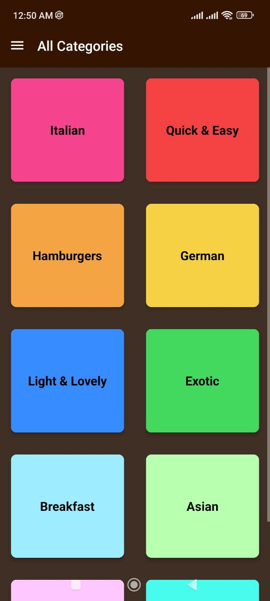
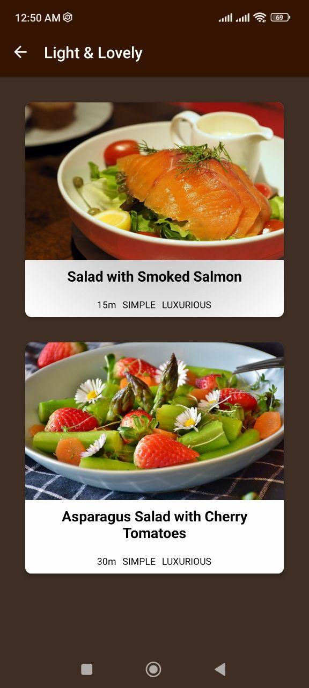
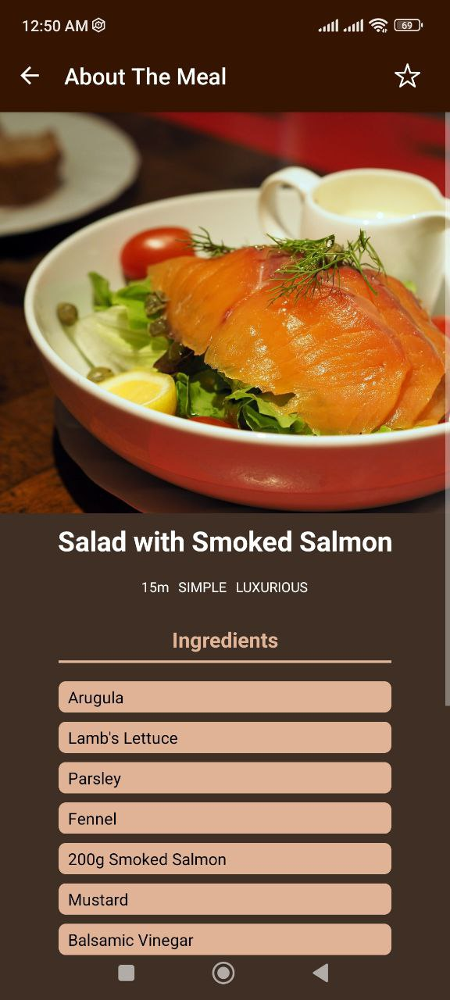
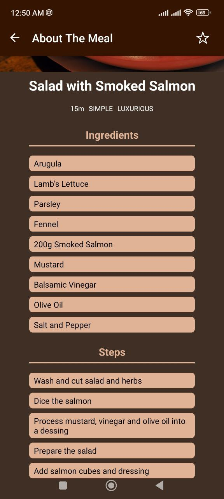
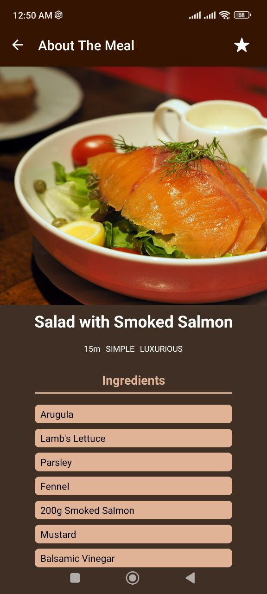
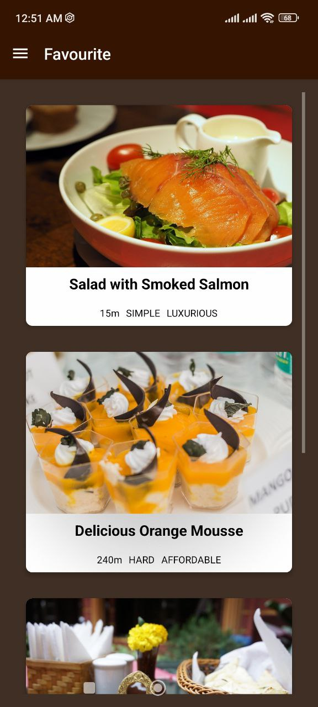
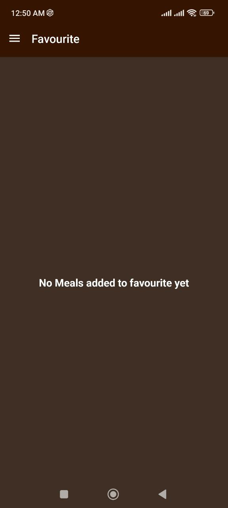

# 🍽️ MealsApp - React Native Food Recipe Application

A comprehensive React Native application built with Expo that helps users discover, explore, and manage their favorite meal recipes. The app features an intuitive interface with categorized meals, detailed recipe information, and a personal favorites system.

[](https://reactnative.dev/)
[](https://expo.dev/)
[](https://reactnavigation.org/)
[](LICENSE)

## 📱 Screenshots

<table>
<tr>
    <td></td>
    <td></td>
    <td></td>
  </tr>
  <tr>
    <td></td>
    <td></td>
    <td></td>
  </tr>
  <tr>
    <td></td>
  </tr>
  
</table>

## ✨ Features

### 🏠 Core Functionality

- **Category-based Meal Organization**: Browse meals by cuisine type (Italian, Asian, German, etc.)
- **Detailed Recipe Information**: Complete ingredients list and step-by-step cooking instructions
- **Favorites Management**: Save and manage your favorite recipes
- **Cross-platform Compatibility**: Runs on iOS, Android, and Web

### 🎨 User Experience

- **Intuitive Navigation**: Seamless drawer and stack navigation
- **Dark Theme Design**: Elegant dark theme throughout the app
- **Visual Feedback**: Interactive elements with press states and ripple effects
- **Responsive Layout**: Optimized for different screen sizes

### 🛠️ Technical Features

- **Context API State Management**: Global state for favorites without external dependencies
- **Performance Optimized**: FlatList implementation for efficient rendering
- **Type-safe Models**: Structured data models for categories and meals
- **Comprehensive Documentation**: Well-documented codebase for maintainability

## 🚀 Getting Started

### Prerequisites

Before running this project, make sure you have the following installed:

- [Node.js](https://nodejs.org/) (version 18 or higher)
- [npm](https://www.npmjs.com/) or [yarn](https://yarnpkg.com/)
- [Expo CLI](https://docs.expo.dev/get-started/installation/)
- [Android Studio](https://developer.android.com/studio) (for Android development)
- [Xcode](https://developer.apple.com/xcode/) (for iOS development - macOS only)

### Installation

1. **Clone the repository**

   ```bash
   git clone https://github.com/yourusername/mealsapp.git
   cd mealsapp
   ```

2. **Install dependencies**

   ```bash
   npm install
   # or
   yarn install
   ```

3. **Start the development server**

   ```bash
   npm run start
   # or
   expo start
   ```

4. **Run on specific platforms**

   ```bash
   # Android
   npm run android

   # iOS
   npm run ios

   # Web
   npm run web
   ```

## 📁 Project Structure

```
MealsApp/
├── assets/                     # Images and static assets
│   ├── icon.png
│   ├── splash-icon.png
│   └── ...
├── components/                 # Reusable UI components
│   ├── CategoryGridTile.js     # Category display tile
│   ├── IconButton.js           # Reusable icon button
│   ├── List.js                 # Generic list component
│   ├── MealDetails.js          # Meal metadata display
│   ├── MealItem.js             # Individual meal card
│   ├── MealsList.js            # Meals list container
│   └── SubTitle.js             # Section subtitle component
├── data/                       # Data and mock data
│   └── dummy-data.js           # Sample meals and categories
├── models/                     # Data models
│   ├── category.js             # Category model class
│   └── meal.js                 # Meal model class
├── screens/                    # Screen components
│   ├── CategoriesScreen.js     # Main categories grid
│   ├── FavouriteScreen.js      # Favorite meals display
│   ├── MealDetailsScreen.js    # Detailed meal view
│   └── MealOverviewScreen.js   # Category meals list
├── store/                      # State management
│   └── context/
│       └── favourite-context.js # Global favorites context
├── App.js                      # Main app component
├── index.js                    # App entry point
├── app.json                    # Expo configuration
├── package.json                # Dependencies and scripts
└── README.md                   # Project documentation
```

## 🏗️ Architecture

### Navigation Structure

The app uses React Navigation with a hybrid navigation structure:

```
Stack Navigator (Root)
├── Drawer Navigator
│   ├── Categories Screen
│   └── Favourites Screen
├── Meal Overview Screen
└── Meal Details Screen
```

### State Management

- **React Context API**: Used for global favorites state management
- **Local State**: Component-level state using React hooks
- **No External Dependencies**: Lightweight state management approach

### Data Flow

1. **Categories**: Static data loaded from `dummy-data.js`
2. **Meals**: Filtered based on category selection
3. **Favorites**: Managed through Context API across all screens
4. **Navigation**: Parameter passing between screens for data transfer

## 🎨 Design System

### Color Palette

```css
/* Primary Colors */
--primary-brown: #351401
--secondary-brown: #3f2f25
--accent-brown: #e2b497

/* Text Colors */
--text-primary: #ffffff
--text-secondary: #351401

/* Background Colors */
--background-dark: #24180f
--card-background: #ffffff
```

### Typography

- **Headers**: Bold, 24px
- **Subtitles**: Bold, 18px
- **Body Text**: Regular, 16px
- **Detail Text**: Regular, 12px

## 📦 Dependencies

### Core Dependencies

| Package                    | Version  | Purpose              |
| -------------------------- | -------- | -------------------- |
| `react-native`             | 0.79.5   | Core framework       |
| `expo`                     | ~53.0.20 | Development platform |
| `@react-navigation/native` | ^7.1.14  | Navigation library   |
| `@react-navigation/stack`  | ^7.4.2   | Stack navigation     |
| `@react-navigation/drawer` | ^7.5.4   | Drawer navigation    |

### UI Dependencies

| Package                          | Version | Purpose                    |
| -------------------------------- | ------- | -------------------------- |
| `react-native-vector-icons`      | ^10.3.0 | Icon library               |
| `react-native-screens`           | ~4.11.1 | Native screen optimization |
| `react-native-safe-area-context` | 5.4.0   | Safe area handling         |
| `react-native-gesture-handler`   | ~2.24.0 | Gesture recognition        |
| `react-native-reanimated`        | ~3.17.4 | Animations                 |

## 🧩 Components Documentation

### Screen Components

#### `CategoriesScreen`

- **Purpose**: Displays meal categories in a 2-column grid
- **Navigation**: Routes to `MealOverviewScreen` with category data
- **Features**: Color-coded category tiles with press feedback

#### `MealOverviewScreen`

- **Purpose**: Shows meals filtered by selected category
- **Data**: Receives `categoryId` from navigation params
- **Features**: Uses `MealsList` component for consistent display

#### `MealDetailsScreen`

- **Purpose**: Displays comprehensive meal information
- **Features**: Image, ingredients, steps, and favorite toggle
- **State**: Integrates with favorites context

#### `FavouriteScreen`

- **Purpose**: Shows user's favorite meals
- **State**: Reads from favorites context
- **Features**: Empty state handling

### Reusable Components

#### `CategoryGridTile`

- **Props**: `title`, `color`, `onPress`
- **Features**: Cross-platform press effects, custom styling

#### `MealItem`

- **Props**: Meal data and `onPress` handler
- **Features**: Card layout with image, title, and meal details

#### `MealsList`

- **Props**: `items` array and `navigation` object
- **Features**: FlatList implementation with navigation

## 🔧 Development

### Code Style

The project follows standard React Native and JavaScript conventions:

- **ES6+ Features**: Arrow functions, destructuring, template literals
- **Component Structure**: Functional components with hooks
- **Documentation**: JSDoc-style comments throughout
- **File Organization**: Logical separation by feature and component type

### Best Practices

- **Performance**: FlatList for large data sets
- **Accessibility**: Proper component labeling and navigation
- **Cross-platform**: Platform-specific code where necessary
- **State Management**: Minimal and efficient state updates

### Adding New Features

1. **New Screen**: Add to `screens/` directory and update navigation
2. **New Component**: Add to `components/` with proper documentation
3. **New Data**: Update models and dummy data as needed
4. **State Changes**: Modify context providers if global state is affected

## 🧪 Testing

### Manual Testing Checklist

- [ ] Category navigation works correctly
- [ ] Meal details display properly
- [ ] Favorites can be added/removed
- [ ] Drawer navigation functions
- [ ] App works on both platforms (iOS/Android)

### Recommended Testing Tools

- **Jest**: Unit testing framework
- **React Native Testing Library**: Component testing
- **Detox**: End-to-end testing
- **Flipper**: Development debugging

## 📱 Build and Deployment

### Development Build

```bash
# Start development server
expo start

# Build for specific platform
expo build:android
expo build:ios
```

### Production Build

```bash
# Create production build
eas build --platform all

# Submit to stores
eas submit --platform ios
eas submit --platform android
```

### Environment Configuration

Update `app.json` for different environments:

```json
{
  "expo": {
    "name": "MealsApp",
    "slug": "mealsapp",
    "version": "1.0.0",
    "orientation": "portrait"
  }
}
```

## 🤝 Contributing

We welcome contributions to the MealsApp project! Please follow these guidelines:

### Getting Started

1. Fork the repository
2. Create a feature branch (`git checkout -b feature/amazing-feature`)
3. Make your changes
4. Commit your changes (`git commit -m 'Add amazing feature'`)
5. Push to the branch (`git push origin feature/amazing-feature`)
6. Open a Pull Request

### Contribution Guidelines

- Follow the existing code style and conventions
- Add documentation for new components and features
- Test your changes thoroughly
- Update README.md if necessary

## 📝 License

This project is licensed under the MIT License - see the [LICENSE](LICENSE) file for details.

## 📞 Support

If you have any questions or issues, please:

1. Check the [Issues](https://github.com/MahmoudSamyDev/MealsApp-ReactNative-app/issues) page
2. Create a new issue with detailed description
3. Contact the maintainers

## 🙏 Acknowledgments

- **React Native Team** for the excellent framework
- **Expo Team** for the development platform
- **React Navigation** for navigation solutions
- **Community** for inspiration and support

## 🔮 Future Enhancements

- [ ] **Search Functionality**: Add meal search and filtering
- [ ] **User Authentication**: Personal accounts and cloud sync
- [ ] **Recipe Sharing**: Share recipes with other users
- [ ] **Shopping Lists**: Generate shopping lists from recipes
- [ ] **Nutrition Information**: Add nutritional data
- [ ] **Meal Planning**: Weekly meal planning features
- [ ] **Offline Support**: Cache recipes for offline viewing
- [ ] **Multiple Languages**: Internationalization support

---

**Made with ❤️ using React Native and Expo**

_Last updated: July 27, 2025_
